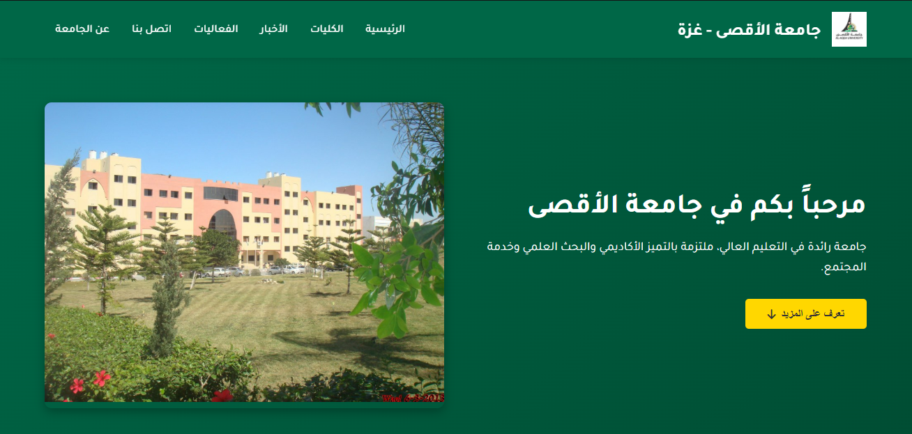
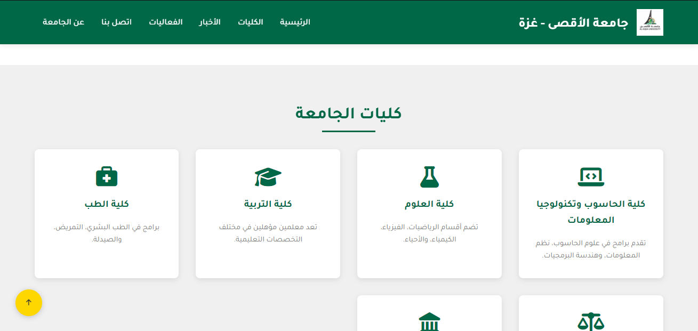
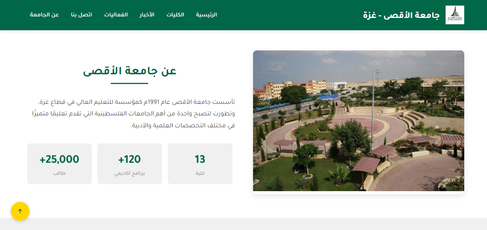

# Al-Aqsa University Website

A responsive Arabic university website developed as an individual academic project for the **Web 1** course.

The project was built from scratch using **HTML, CSS, and vanilla JavaScript**, with a focus on page structure, responsive layouts, visual consistency, interaction, and fundamental front-end development concepts.

## Live Demo

**[View Live Website](https://mohamed-issam-1.github.io/university-website/)**

## Project Preview

## About the Project

This project presents a university-style website inspired by Al-Aqsa University.

It was created as an individual project during the Web 1 course to apply the fundamentals of front-end web development without using frameworks.

The interface is built in Arabic with an RTL layout and includes several university-related sections such as faculties, news, events, university information, and contact details.

## Features

- Arabic RTL user interface
- Responsive page layout
- University landing section
- About the university section
- Faculties showcase
- News section
- Events section
- Contact section
- Embedded Google Maps
- Smooth scrolling
- Scroll-based animations
- Interactive UI elements
- Back-to-top navigation

## Technologies Used

- HTML5
- CSS3
- JavaScript
- Font Awesome
- AOS — Animate On Scroll
- SweetAlert2
- Google Fonts
- Google Maps Embed

## Screenshots

### Home

### Faculties

### About the University

## Project Context

- **Type:** Academic Project
- **Course:** Web 1
- **Development:** Individual
- **Status:** Completed
- **Interface Language:** Arabic
- **Direction:** RTL

## What I Practiced

Through this project, I practiced:

- Structuring web pages with semantic HTML
- Building layouts and components with CSS
- Working with responsive design concepts
- Adding interactions using vanilla JavaScript
- Integrating third-party libraries
- Organizing front-end assets
- Designing an Arabic RTL interface

## Run Locally

No installation or build process is required.

1. Clone the repository: `git clone https://github.com/Mohamed-Issam-1/university-website.git`
2. Open the project folder.
3. Open `index.html` in your browser.

## Developer

**Mohamed Issam Qeshta**

Full-Stack Web Developer & Computer Science Student

- [GitHub](https://github.com/Mohamed-Issam-1)
- [LinkedIn](https://www.linkedin.com/in/mohamed-qeshta/)
- Email: mo.es.qe.18.2@gmail.com

---

This project is part of my learning journey in web development and will be included in my personal portfolio.
